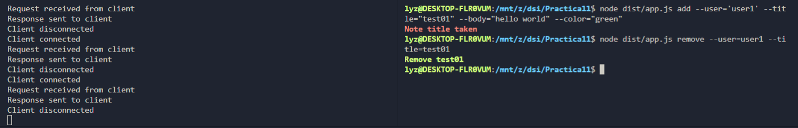

# Práctica 11 - Cliente y servidor para una aplicación de procesamiento de notas de texto
```
Autora: Xue Mei Lin
Curso: 2021- 2022
Universidad: Universidad de La laguna
Asignatura: Desarrollo de Sistemas Informaticos
Herramienta: Visual Studio Code
Lenguaje de programción: TypeScipt
```
## 1. Introducción

El propósito de esta practica es implementar un servidor y un cliente mediante el uso de los sockets proporcionados por el modulo net de Node.js.

Las operaciones que vamos a implementar en esta practica esta basado en la [practica09](https://ull-esit-inf-dsi-2122.github.io/ull-esit-inf-dsi-21-22-prct09-filesystem-notes-app-XueMei-L/)

## 2. Objetivos

- Familiarizar con el [módulo `net` de Node.js](https://nodejs.org/dist/latest-v16.x/docs/api/net.html).
- Familiarícese con la clase [`EventEmitter` del módulo `Events` de Node.js](https://nodejs.org/dist/latest-v16.x/docs/api/events.html#events_class_eventemitter).
- Usar los paquetes [yargs](https://www.npmjs.com/package/yargs) y [chalk](https://www.npmjs.com/package/chalk).

## 3. Desarrollo
El desarrollo de esta practica se basa en la [practica09](https://ull-esit-inf-dsi-2122.github.io/ull-esit-inf-dsi-21-22-prct09-filesystem-notes-app-XueMei-L/) . Los ficheros `app.ts` y `notes.ts` son casi lo mismo que la practica anterior, los unicos cambios que,  en vez de llamar la funcion para crear, eliminar, listar, crea un objeto JSON y pasa como parametro (enviando un objeto json al servidor).

### 3.1 Class MessageEventEmitterClient y Class MessageEventEmitterServer
Estas dos clases son heredadas a la clase `EventEmitter` que porporciona Node en el modulo `events`. Las dos clases hacen que cuando recibe un objeto o informacion, recibir todos los trozos de la informacion y guarda en una variable.

### 3.2 Server.ts
Lo que hace es.. crear una instancia de MessageEventEmitterServer,  y pasa el objeto socket como parametro.  Espera que un client se conecta, y apartir de alli, los clientes conectados puede hacer cuaquier operacion (anadir, modificar, eliminar, listar, y leer notas) y devuelve el mensaje como un objeto JSON (en string) al client, indicando si su operacion fuese exito.

### 3.3 Client.ts
En el fichero `cliente.ts` hace que inicia con una instancia de la clase MessageEventEmitterClient, que donde recibe los mensajes en trozos. y pasando un parametro un socket. Enviar mensajes (operacion de añadir, modificar, eliminar, listar, y leer notas) al servidor, y recibe los mensajes atraves de eventos.


## 4. Resultados





## 5. Testing


## 6. Bibliografía
- [Apuntes de la clases](https://ull-esit-inf-dsi-2122.github.io/typescript-theory/)
- [Guión de la práctica](https://ull-esit-inf-dsi-2122.github.io/prct07-music-dataModel/)
- [Inquirer.js](https://www.npmjs.com/package/inquirer)
- [Lowdb](https://www.npmjs.com/package/lowdb)
- [Coveralls](https://coveralls.io/)
- [SounarCould](https://sonarcloud.io/)
- [Yargs](https://www.npmjs.com/package/yargs)
- [Chalk](https://www.npmjs.com/package/chalk)

